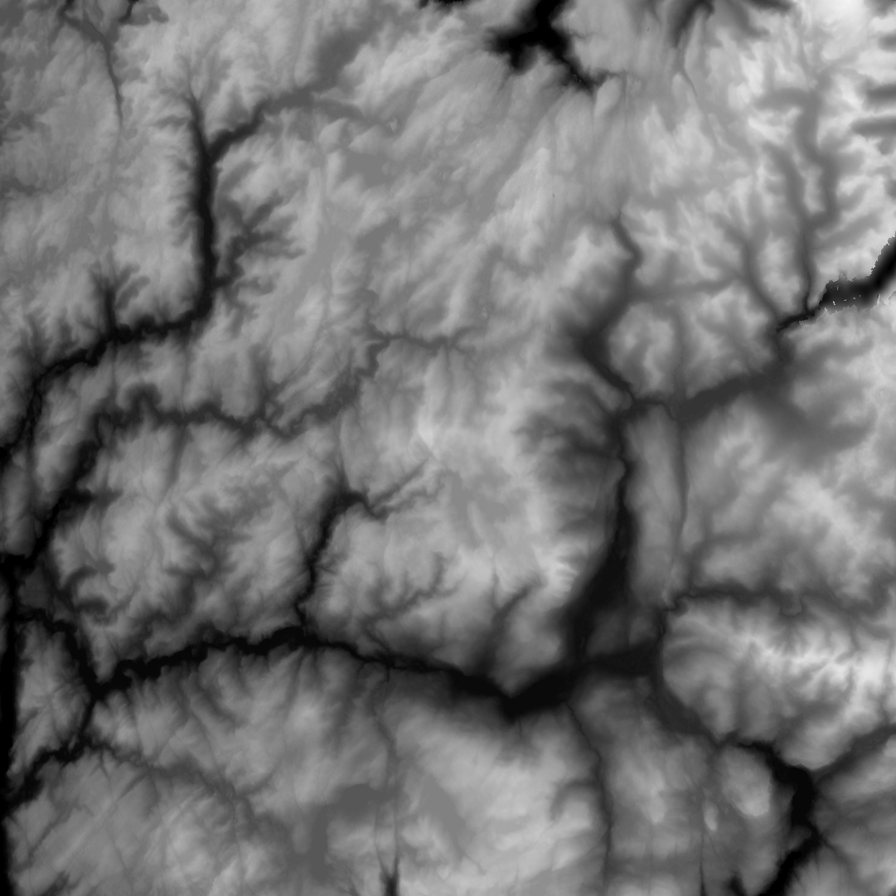
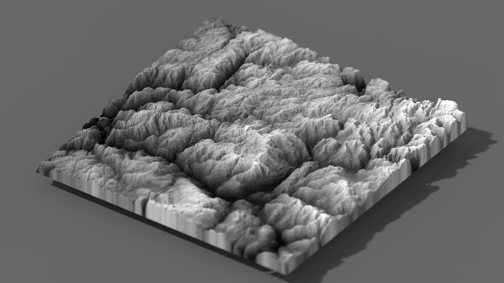

# What is SchematicToVox ? 

SchematicToVox is a console program which allow you to convert a schematic file (Minecraft save) into a vox file (Magicavoxel).
It support world region, so you can convert a terrain bigger than 126^3 voxels ! 

You can also convert an image (only PNG) also with support of world region ! (So you can convert a picture bigger than 126 * 126 pixels)
And you can create terrain from heightmap like in Magicavoxel Viewer directly !

# How use it ? 

- You need to open a console (like cmd or Powershell in Windows)
- Go to the emplacement of the binary
- Lanch the command

`./SchematicToVox.exe --i [INPUT] --o [OUTPUT]`

[INPUT] refer to a .schematic file or .png file (mandatory)
[OUTPUT] refer to the destination path (mandatory)

## Options

```
-h,        --help                     show this message and exit
-v,        --verbose                  enable the verbose mode
-w,        --way=VALUE                the way of schematic (0 or 1), default value is 0
-iminy,    --ignore-min-y=VALUE   ignore blocks below the specified layer
-imaxy,    --ignore-max-y=VALUE   ignore blocks above the specified layer
-e,        --excavate                 delete all blocks which doesn't have at lease one face connected with air
-s,        --scale=VALUE              increase the scale of each block
-hm        --heightmap=VALUE          create voxels terrain from heightmap with the specified height
-c,        --color                enable color when generating heightmap
 ```
 
 # Installation 
 
 Go to the [release](https://github.com/Zarbuz/SchematicToVox/releases) page and download the lastest version of SchematicToVox. Be sure to download the binary and not the source code. 
Then extract the content of zip file in the folder of your choice.

# Examples

`./SchematicToVox.exe --i heighmap.png --o heightmap --hm 100`

## Input file


## Ouput file


## Render


