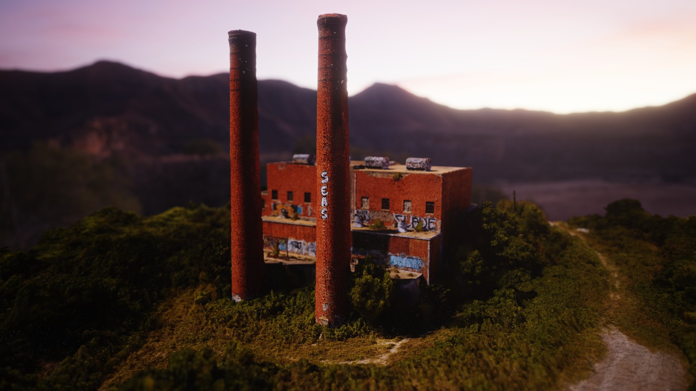
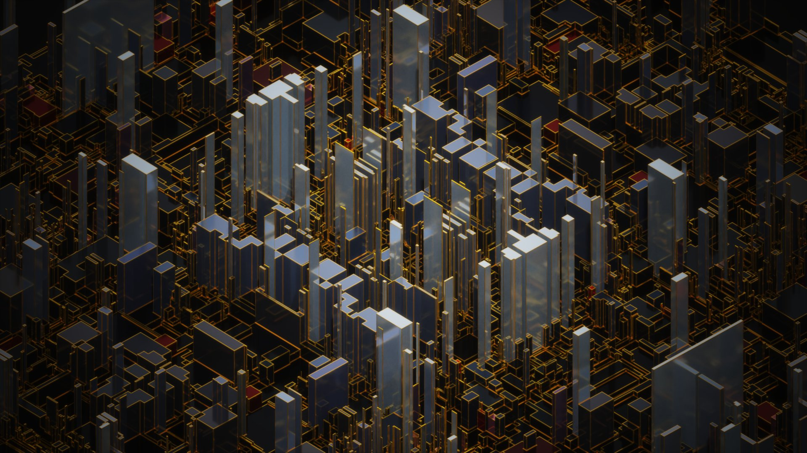
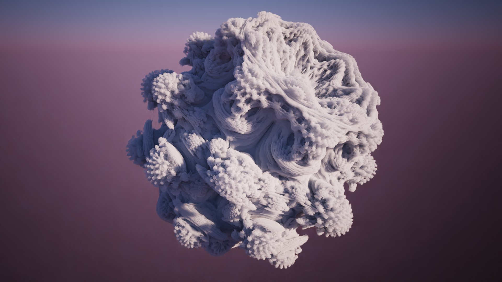

# What is FileToVox ? 

FileToVox is a console program which allow you to convert a file into a vox file (Magicavoxel).

Current files support: 
- .asc (Esri ASCII raster format)
- .binvox
- .csv
- .obj
- .ply (Binary and ASCII)
- .png
- .schematic
- .tif
- .qb (Qubicle)
- .xyz (X Y Z R G B)

FileToVox can import a folder of images (.PNG) where each image is a layer. (Useful for import fractals from Mandelbulb3D) 

It support world region, so you can convert a terrain bigger than 126^3 voxels ! 


# How use it ? 

- You need to open a console (like cmd or Powershell in Windows)
- Go to the emplacement of FileToVox.exe
- Launch the command : `./FileToVox.exe --i [INPUT] --o [OUTPUT]`
- [INPUT] refer to a input filepath (mandatory)
- [OUTPUT] refer to the destination path (mandatory)

## MacOS or Linux

If you have an error like 'Unable to load DLL 'libgdiplus', try this command : `brew install mono-libgdiplus`

If you have this error : 'brew command not found'.

Install first : `/usr/bin/ruby -e "$(curl -fsSL https://raw.githubusercontent.com/Homebrew/install/master/install)"`

## Commands list

```
--i        --input=VALUE              input mandatory file
--o        --output=VALUE             output mandatory file
--c        --color                    enable color when generating heightmap
--cl       --color-limit=VALUE        set the maximal number of colors for the palette
--cm       --color-from-file=VALUE    load color from another file
--e        --excavate                 delete all voxels which doesn't have at least one face connected with air
--fl       --flood                    fill all invisibles voxels (option for PLY, XYZ, CSV)
--fh       --fix-holes                fix holes (option for PLY, XYZ, CSV)
--gs       --grid-size=VALUE          set the grid size (only for OBJ file)
--h        --help                     help informations
--hm       --heightmap=VALUE          create voxels terrain from heightmap with the specified height (only for PNG file)
--iminy    --ignore-min-y=VALUE       ignore voxels below the specified layer (only for schematic file)
--imaxy    --ignore-max-y=VALUE       ignore voxels above the specified layer (only for schematic file)
--sc       --scale=VALUE              set the scale
--sl       --slow=VALUE               use a slower algorithm (use all cores) to generate voxels from OBJ but best result (value should be enter 0.0 and 1.0 (0.5 is recommended)
--t,        --top                     create voxels only at the top of the heightmap
--v,        -verbose                  enable the verbose mode
 ```

## Command compatibility 

| Command | .asc | .binvox | .csv | .obj | .ply | .png | .qb | .schematic | .tif | .xyz |
| --- | --- | --- | --- | --- | --- | --- | --- | --- | --- | --- | 
| `--color`           | ❌ | ❌ | ❌ | ❌ | ❌ | ✅ | ❌ | ❌ | ✅ | ❌ |
| `--color-limit`     | ❌ | ❌ | ✅ | ❌ | ✅ | ✅ | ❌ | ❌ | ✅ | ✅ |
| `--color-from-file` | ❌ | ❌ | ❌ | ❌ | ❌ | ✅ | ❌ | ❌ | ✅ | ❌ |
| `--excavate`        | ❌ | ❌ | ❌ | ✅ | ❌ | ✅ | ❌ | ✅ | ✅ | ❌ |
| `--flood`           | ❌ | ❌ | ✅ | ❌ | ✅ | ❌ | ❌ | ❌ | ❌ | ✅ |
| `--fix-holes`       | ❌ | ❌ | ✅ | ❌ | ✅ | ❌ | ❌ | ❌ | ❌ | ✅ |
| `--grid-size`       | ❌ | ❌ | ❌ | ✅ | ❌ | ❌ | ❌ | ❌ | ❌ | ❌ |
| `--heightmap`       | ❌ | ❌ | ❌ | ❌ | ❌ | ❌ | ❌ | ❌ | ❌ | ❌ |
| `--ignore-min-y`    | ❌ | ❌ | ❌ | ❌ | ❌ | ❌ | ❌ | ✅ | ❌ | ❌ |
| `--ignore-max-y`    | ❌ | ❌ | ❌ | ❌ | ❌ | ❌ | ❌ | ✅ | ❌ | ❌ |
| `--scale`           | ❌ | ❌ | ✅ | ❌ | ✅ | ❌ | ❌ | ✅ | ❌ | ✅ |
| `--slow`            | ❌ | ❌ | ❌ | ✅ | ❌ | ❌ | ❌ | ❌ | ❌ | ❌ |
| `--top`             | ❌ | ❌ | ❌ | ❌ | ❌ | ✅ | ❌ | ❌ | ✅ | ❌ |


# Installation 
 
Go to the [release](https://github.com/Zarbuz/SchematicToVox/releases) page and download the lastest version of FileToVox. Be sure to download the binary and not the source code. 
You also need to install the .NET Core Runtime Library : https://dotnet.microsoft.com/download/dotnet-core/current/runtime
Then extract the content of zip file in the folder of your choice.

## config.txt

You can edit the colors of the palette used when generating from schematic file in `schematics/config.txt`

# Examples

```
./FileToVox.exe --i heightmap.png --o heightmap --hm 100
./FileToVox.exe --i heightmap.png --o heightmap --hm 100 --e --cm colors.png
./FileToVox.exe --i cloud.ply --o cloud --scale 20
```

## Notes

For PNG files, you can't load pictures bigger than 2016x2016 px

## Input file


## Ouput file


## Renders








